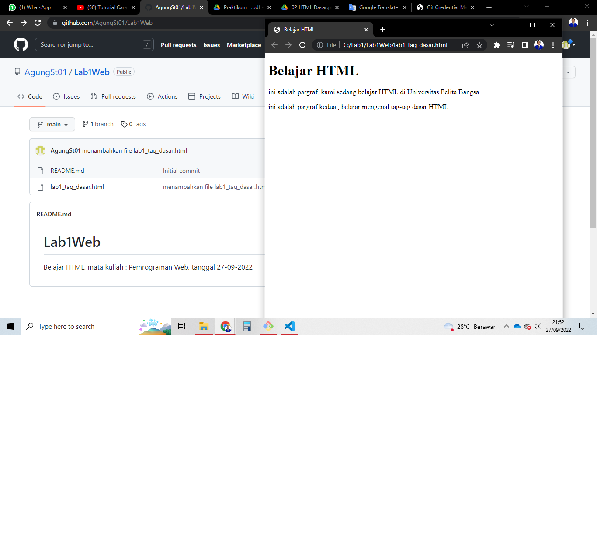

# Lab1Web
Belajar HTML, mata kuliah : Pemrograman Web, tanggal 27-09-2022
## Lab1Web

### Membuat Paragraf
kode tag untuk membuat paragraf adalah `
`
ini adalah tampilanya

### Mengubah Nama Tab
Seharusnya sebelum membuat paragraf saya mengubah nama tab nya terlebih dahulu, oleh karena itu disini saya akan meberitahu cara mengubah atau mengganti nama tab dengan cara mengganti konten dari tag`<title></title>`