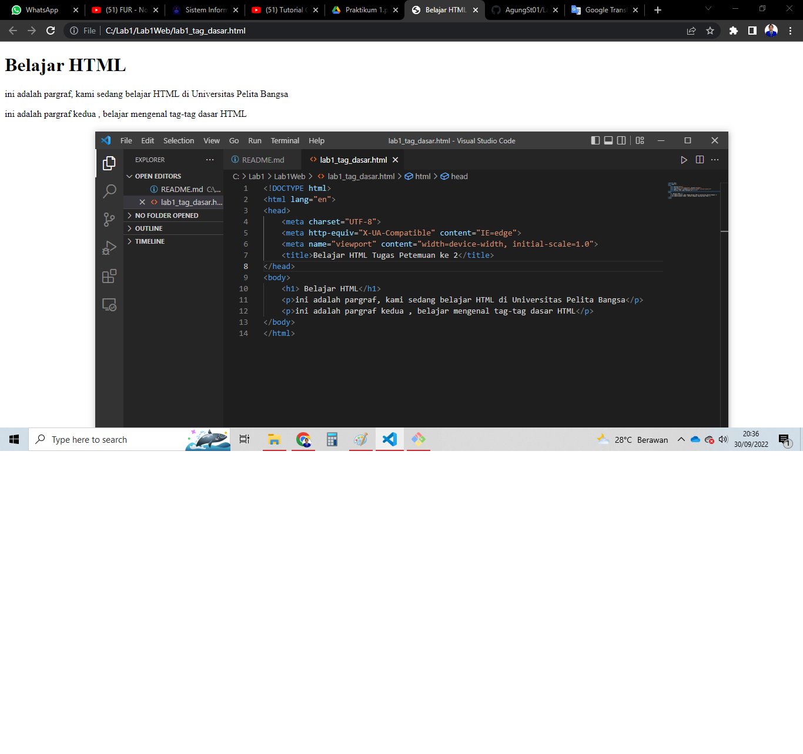
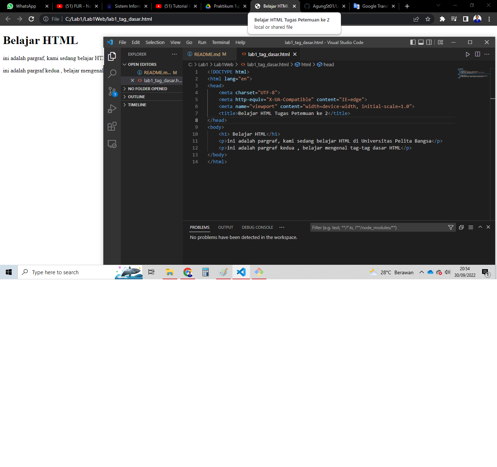
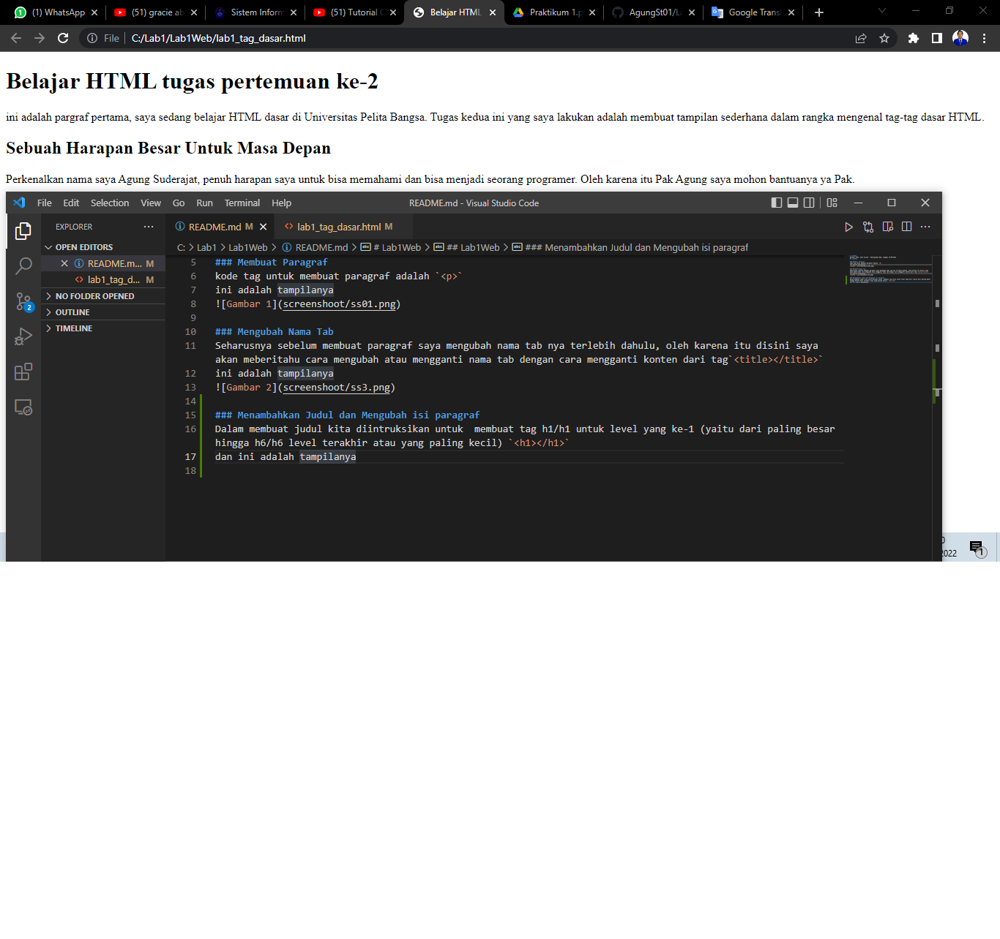
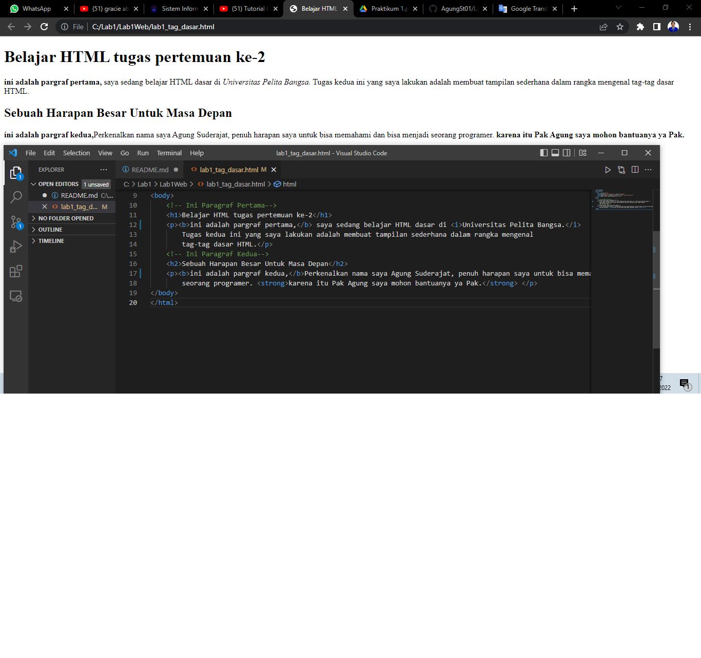

# Lab1Web
Belajar HTML, mata kuliah : Pemrograman Web, tanggal 27-09-2022
## Lab1Web

### Membuat Paragraf
kode tag untuk membuat paragraf adalah `
`
ini adalah tampilanya

### Mengubah Nama Tab
Seharusnya sebelum membuat paragraf saya mengubah nama tab nya terlebih dahulu, oleh karena itu disini saya akan meberitahu cara mengubah atau mengganti nama tab dengan cara mengganti konten dari tag`<title></title>`
ini adalah tampilanya

### Menambahkan Judul dan Mengubah isi paragraf
Dalam membuat judul kita diintruksikan untuk  membuat tag h1/h1 untuk level yang ke-1 (yaitu dari paling besar hingga h6/h6 level terakhir atau yang paling kecil) `<h1></h1>`
dan ini adalah tampilanya

# Memformat Teks 
Ada beberapa tag yang dapat digunakan untuk memformat teks pada paragraf. Diantaranya adalah
sebagai berikut:
Tag Keterangan
`<b>` Bold text
`<strong>` Important text
`<i>` Italic text
dan ini adalah tampilan nya
